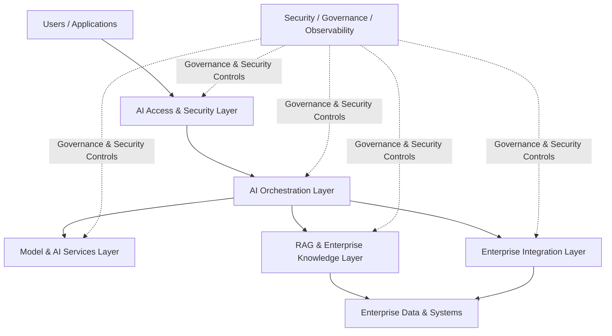
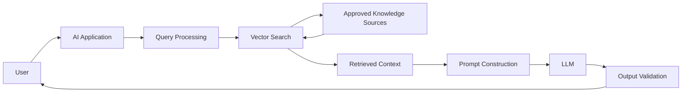
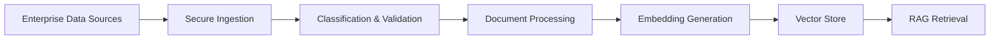
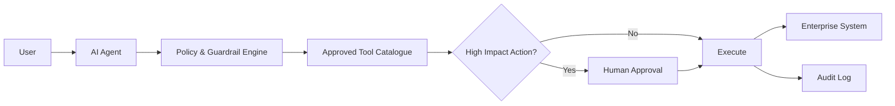

# Enterprise AI Reference Architecture

## 1. Purpose

This document defines the enterprise reference architecture for Artificial Intelligence solutions deployed within Austera Transport Group (ATG).

The architecture provides a secure and governed foundation for:

- Generative AI
- Large Language Models (LLMs)
- Retrieval-Augmented Generation (RAG)
- Enterprise AI assistants
- AI-enabled applications
- AI agents
- Predictive and Machine Learning workloads
- Third-party AI services

The reference architecture translates ATG's AI governance, risk and security requirements into architectural patterns and guardrails.

---

## 2. Architecture Objectives

The architecture is designed to:

1. Enable secure enterprise adoption of AI.
2. Protect enterprise and personal information.
3. Enforce identity-based access.
4. Maintain network and workload isolation.
5. Secure access to models and enterprise data.
6. Support secure RAG patterns.
7. Control AI agent permissions and actions.
8. Provide central security monitoring and auditability.
9. Support multi-cloud AI adoption.
10. Embed governance throughout the AI lifecycle.

---

## 3. Architecture Principles

The architecture follows these core principles:

- Zero Trust
- Security by Design
- Privacy by Design
- Least Privilege
- Defence in Depth
- Private Connectivity Where Appropriate
- API-First Integration
- Identity-Centric Security
- Data Minimisation
- Human Oversight
- Assume AI Output is Untrusted
- Centralised Observability
- Infrastructure as Code
- Policy as Code
- Controlled AI Autonomy

Detailed principles are defined within `architecture-principles.md`.

---

## 4. Logical Architecture

The enterprise AI platform is divided into the following logical layers:

---

## 5. User and Application Layer

AI capabilities may be consumed through:

- Enterprise web applications
- Mobile applications
- Enterprise copilots
- Internal AI assistants
- Business applications
- APIs
- Developer tools
- AI agents

Users must authenticate through approved enterprise identity mechanisms where supported.

Access must follow least-privilege and role-based access principles.

---

## 6. AI Access and Security Layer

All enterprise AI access should pass through controlled security and integration services appropriate to the use case.

Capabilities may include:

- Enterprise identity
- API gateway
- Web Application Firewall
- AI gateway
- Authentication
- Authorisation
- Rate limiting
- Content filtering
- Prompt filtering
- Request validation
- DLP controls
- Abuse protection

This layer provides a controlled boundary between consumers and AI services.

---

## 7. Identity Architecture

Identity is the primary security boundary for enterprise AI.

The architecture should support:

### Human Identity

Users authenticate through enterprise identity services.

Controls may include:

- Single Sign-On
- MFA
- Conditional Access
- RBAC
- Privileged Identity Management

### Workload Identity

Applications should use managed or workload identities where supported.

Long-lived static credentials should be avoided.

### AI Agent Identity

AI agents should operate using dedicated identities.

Agent activity must be distinguishable from human activity and must operate within explicitly defined permission boundaries.

---

## 8. AI Orchestration Layer

The orchestration layer manages interaction between users, models, enterprise data and tools.

Capabilities may include:

- Prompt orchestration
- Model routing
- Context management
- RAG orchestration
- Agent orchestration
- Tool selection
- Guardrails
- Content filtering
- Policy enforcement
- Human approval workflows

This layer must not implicitly trust model output.

---

## 9. Model and AI Services Layer

The architecture supports multiple model deployment patterns.

These may include:

### Managed Enterprise Models

Cloud-hosted enterprise AI services.

### Third-Party Models

Approved external AI providers accessed through controlled APIs.

### Self-Hosted Models

Models hosted within enterprise-controlled cloud or compute environments.

### Specialised Models

Domain-specific or fine-tuned models approved for particular use cases.

Model selection must consider:

- Security
- Privacy
- Performance
- Cost
- Data handling
- Model capability
- Availability
- Regulatory requirements

---

## 10. Model Gateway Pattern

Where multiple models or providers are used, an AI/model gateway should be considered.

The gateway may provide:

- Central model access
- Model routing
- Authentication
- Authorisation
- Usage controls
- Rate limiting
- Logging
- Cost controls
- Policy enforcement
- Provider abstraction

Applications should avoid uncontrolled direct connections to external models where central governance is required.

---

## 11. Retrieval-Augmented Generation Architecture

Enterprise RAG allows AI models to use approved organisational information without requiring that information to be embedded permanently within the base model.

A typical RAG flow is:

---

## 12. RAG Security Requirements

RAG solutions must maintain enterprise security boundaries.

Controls include:

- Approved knowledge sources
- Document classification
- User authorisation
- Source-level permissions
- Secure document ingestion
- Vector-store protection
- Encryption
- Private connectivity where appropriate
- Data lineage
- Logging
- Content validation

A user must not obtain information through AI that they are not authorised to access through the source system.

---

## 13. Knowledge Ingestion Pipeline

Enterprise knowledge should enter the AI environment through a controlled ingestion pipeline.

Example:

Controls should consider:

- Malware scanning
- Content validation
- Data classification
- Metadata
- Access permissions
- Data lineage
- Document freshness
- Poisoning detection

---

## 14. Vector Store Security

Vector databases must be treated as enterprise data stores.

Controls must include, where applicable:

- Authentication
- Authorisation
- Encryption
- Network isolation
- Private connectivity
- Logging
- Backup
- Retention
- Deletion
- Tenant separation

Embeddings must not automatically be considered non-sensitive.

---

## 15. AI Agent Architecture

AI agents introduce additional risk because they may perform actions rather than only generate information.

A controlled agent pattern is:

---

## 16. Agent Security

AI agents must operate within defined trust boundaries.

Controls include:

- Dedicated workload identity
- Least privilege
- Tool allowlisting
- API permission boundaries
- Transaction limits
- Human approval
- Comprehensive logging
- Kill-switch capability

Agents must not receive unrestricted administrative access merely for implementation convenience.

---

## 17. Enterprise Integration Layer

AI systems may integrate with:

- APIs
- Databases
- Document repositories
- CRM platforms
- ERP platforms
- Asset-management platforms
- Collaboration platforms
- Operational systems
- Cloud services

Integration should occur through controlled enterprise integration patterns.

Direct uncontrolled model-to-system connectivity should be avoided.

---

## 18. API Security

AI integrations must implement appropriate API security including:

- Authentication
- Authorisation
- TLS
- Request validation
- Rate limiting
- Logging
- Threat protection
- Secrets management

API gateways should be considered for central policy enforcement.

---

## 19. Network Architecture

Sensitive enterprise AI workloads should use network segmentation appropriate to risk.

Typical zones may include:

- User/Application Zone
- AI Services Zone
- Integration Zone
- Data Zone
- Management Zone

Controls may include:

- Private endpoints
- Network security groups
- Firewalls
- Controlled routing
- Private DNS
- Restricted internet egress
- DDoS protection
- WAF

---

## 20. Data Architecture

Enterprise AI data may include:

- Structured data
- Documents
- Images
- Operational data
- Knowledge repositories
- Metadata
- Embeddings
- Prompts
- Model responses

Existing data governance requirements continue to apply.

AI must not create an uncontrolled alternative path around enterprise data governance.

---

## 21. Secrets Management

AI applications must use approved enterprise secrets-management services.

Secrets include:

- API keys
- Tokens
- Certificates
- Database credentials
- Model-provider credentials

Secrets must not be embedded in:

- Source code
- Prompts
- Configuration repositories
- Container images

Managed identity should be preferred where available.

---

## 22. Observability Architecture

AI workloads require both traditional application observability and AI-specific monitoring.

Telemetry may include:

### Platform

- Availability
- Latency
- Errors
- Resource utilisation

### Security

- Authentication events
- Authorisation failures
- Prompt attacks
- Data-access anomalies
- Agent actions
- Tool invocation

### AI

- Model usage
- Token consumption
- Guardrail violations
- Model performance
- Response quality
- Model drift

---

## 23. Security Monitoring

Security-relevant telemetry should integrate with enterprise security-monitoring capabilities.

The monitoring architecture should support:

**AI Platform → Central Logging → SIEM → Detection → SOC / Incident Response**

Detection scenarios may include:

- Repeated prompt injection
- Sensitive data extraction
- Unusual model access
- Excessive data retrieval
- Agent privilege misuse
- Abnormal API activity
- Unexpected administrative changes

---

## 24. Human Oversight

Human oversight must be embedded where AI actions could create significant impact.

Human approval may be required before:

- Financial transactions
- Infrastructure changes
- Sensitive communications
- Customer decisions
- Data deletion
- Privileged actions
- Operational changes

Human approval must represent a meaningful control rather than a procedural formality.

---

## 25. DevSecOps

AI applications must follow secure software-delivery practices.

The delivery pipeline should support:

**Source → Build → Security Scan → Test → AI Security Test → Approval → Deploy → Monitor**

Controls may include:

- Infrastructure as Code
- Policy as Code
- SAST
- Dependency scanning
- Secrets scanning
- Container scanning
- API testing
- Prompt-injection testing
- Access-control testing

---

## 26. Infrastructure as Code

Cloud infrastructure supporting AI should be deployed using Infrastructure as Code where practical.

Potential technologies include:

- Terraform
- Azure Bicep
- AWS CloudFormation

IaC enables:

- Repeatability
- Security review
- Version control
- Automated compliance
- Environment consistency

---

## 27. Multi-Cloud Architecture

ATG operates across Azure and AWS.

The AI governance model should therefore remain technology-neutral while allowing cloud-specific implementation.

Examples:

| Capability | Azure Example | AWS Example |
|---|---|---|
| Enterprise Identity | Microsoft Entra ID | IAM / IAM Identity Center |
| Managed GenAI | Azure OpenAI | Amazon Bedrock |
| Secrets | Azure Key Vault | AWS Secrets Manager |
| API Management | Azure API Management | Amazon API Gateway |
| Security Monitoring | Microsoft Sentinel | Security Hub / SIEM Integration |
| Private Connectivity | Private Link | AWS PrivateLink |
| Policy | Azure Policy | AWS Config / Organizations |
| Logging | Azure Monitor | CloudWatch / CloudTrail |

Cloud implementation does not change the underlying governance requirement.

---

## 28. Architecture Governance

AI solutions must pass architecture governance appropriate to risk.

Architecture review should assess:

- Business context
- Risk classification
- Identity
- Network design
- Data flows
- Model selection
- RAG design
- Agent permissions
- Integrations
- Security controls
- Privacy
- Resilience
- Monitoring

Tier 3 and Tier 4 AI systems require enhanced architecture and security assurance.

---

## 29. Architecture Decision Records

Material architecture decisions should be documented.

Examples include:

- Model-provider selection
- RAG design
- Vector-store selection
- Public versus private model access
- Agent autonomy
- Identity model
- Data-residency decisions
- Third-party AI adoption

Architecture Decision Records provide traceability between design decisions and risk acceptance.

---

## 30. Resilience

AI solutions must define behaviour when:

- Models are unavailable
- APIs fail
- Requests time out
- RAG retrieval fails
- Guardrails block requests
- AI output is invalid
- Agent actions fail

Critical processes must not depend on uncontrolled AI behaviour.

---

## 31. Architecture Traceability

Architecture controls must trace back to governance and risk requirements.

The intended relationship is:

**Business Requirement  
↓  
AI Use Case  
↓  
Risk Classification  
↓  
Policy  
↓  
Security Control  
↓  
Architecture Pattern  
↓  
Technical Implementation  
↓  
Evidence  
↓  
Assurance**

This provides end-to-end governance traceability.

---

## 32. Related Artefacts

- Enterprise AI Governance Framework
- AI Governance Operating Model
- Responsible AI Policy
- Generative AI Policy
- AI Security Standard
- AI Risk Classification Methodology
- Enterprise AI Risk Assessment
- AI Control Catalogue
- NIST AI RMF Mapping
- ISO/IEC 42001 Mapping
- Security Control Mapping
- Architecture Principles
- AI Go-Live Checklist
- AI Monitoring Framework

---

## Disclaimer

Austera Transport Group (ATG) is a fictional organisation created solely for this professional portfolio project.

This reference architecture is a conceptual enterprise architecture model and must be adapted to specific business, technology, security, regulatory and operational requirements.
