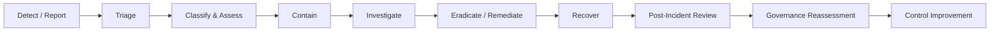
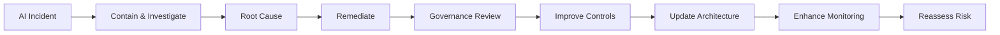

# AI Incident Management Framework

## 1. Purpose

This framework defines how Austera Transport Group (ATG) identifies, reports, assesses, contains, investigates, resolves and learns from incidents involving Artificial Intelligence systems.

AI incidents must integrate with existing enterprise cybersecurity, privacy, operational and risk-management processes rather than operate as a separate incident-management function.

The framework addresses incidents involving:

- Generative AI
- Large Language Models
- Retrieval-Augmented Generation
- AI agents
- Machine Learning
- AI-enabled applications
- Third-party AI services
- Enterprise AI platforms

---

## 2. Objectives

The framework aims to:

1. Detect AI incidents quickly.
2. Establish clear ownership and escalation.
3. Limit business, security, privacy and safety impact.
4. Preserve evidence for investigation.
5. Restore services safely.
6. Identify root causes.
7. Meet applicable notification obligations.
8. Feed lessons back into AI governance.
9. Prevent recurrence.
10. Trigger reassessment where required.

---

## 3. What Is an AI Incident?

An AI incident is an event involving an AI system that causes, or has the potential to cause:

- Security compromise
- Sensitive-information disclosure
- Privacy breach
- Unsafe behaviour
- Unauthorised system action
- Materially incorrect business outcome
- Significant operational disruption
- Regulatory or contractual breach
- Loss of AI-system integrity

AI incidents may originate from malicious activity, technical failure, human error, model behaviour, data issues or third-party providers.

---

## 4. AI Incident Categories

### Security Incidents

Examples include:

- Prompt-injection compromise
- Unauthorised AI access
- Credential exposure
- Model compromise
- API compromise
- Agent privilege misuse
- Knowledge-base poisoning

### Data and Privacy Incidents

Examples include:

- Sensitive-data disclosure
- Personal-information exposure
- Unauthorised retrieval
- Cross-user information leakage
- Improper AI-provider data use

### Model Incidents

Examples include:

- Significant hallucination
- Model drift
- Unsafe output
- Unexpected model behaviour
- Material degradation in accuracy

### Agentic AI Incidents

Examples include:

- Unauthorised tool invocation
- Unapproved transaction
- Unauthorised system modification
- Excessive data retrieval
- Agent operating outside defined boundaries

### Operational Incidents

Examples include:

- Model outage
- AI gateway failure
- RAG failure
- Integration failure
- Excessive latency
- Unbounded resource consumption

### Third-Party Incidents

Examples include:

- AI-provider breach
- Provider data exposure
- Compromised model supply chain
- Unauthorised provider model change
- Material provider outage

---

## 5. Incident Lifecycle

---

## 6. Incident Severity

AI incidents should align with the enterprise incident-severity model.

An indicative model is:

| Severity | Description | Example |
|---|---|---|
| SEV-4 Low | Limited impact | Isolated inappropriate AI response |
| SEV-3 Medium | Moderate impact requiring investigation | Repeated guardrail bypass attempts |
| SEV-2 High | Significant business/security/privacy impact | Sensitive enterprise data disclosure |
| SEV-1 Critical | Severe or widespread impact | Compromised autonomous agent affecting critical operations |

Severity must consider:

- Business impact
- Data sensitivity
- Number of affected users
- AI autonomy
- Operational impact
- Safety impact
- Regulatory implications
- External exposure

---

## 7. Detection

AI incidents may be detected through:

- Security monitoring
- SIEM alerts
- Application monitoring
- Model monitoring
- User reports
- DLP alerts
- Agent monitoring
- Vendor notifications
- Audit activity
- Privacy monitoring

AI-specific telemetry should integrate with existing monitoring capabilities wherever practical.

---

## 8. Reporting

Suspected AI incidents must be reported through established organisational incident channels.

Users should report:

- Unexpected AI behaviour
- Sensitive information exposed to AI
- Restricted information returned by AI
- Suspicious AI access
- Unexpected agent actions
- Significant inaccurate output
- Suspected prompt attacks

Users should not attempt to conceal accidental AI misuse.

---

## 9. Initial Triage

Initial triage should determine:

- Which AI system is affected?
- Is the incident ongoing?
- What data may be affected?
- Is an AI agent involved?
- Are enterprise systems affected?
- Is personal information involved?
- Is a third-party provider involved?
- Is critical infrastructure affected?
- Is immediate containment required?

---

## 10. Incident Ownership

Incident ownership depends on incident type.

| Incident Type | Primary Lead |
|---|---|
| Cybersecurity | Cybersecurity / SOC |
| Privacy | Privacy |
| Model Behaviour | Technology / AI Owner |
| Data Governance | Data Governance |
| Operational | Technology Operations |
| Vendor | Vendor Management / Technology |
| Material Enterprise AI Risk | AI Governance Committee |

Complex incidents may require a multidisciplinary response team.

---

## 11. Immediate Containment

Potential containment actions include:

- Disable AI application
- Disable affected agent
- Revoke credentials
- Revoke API keys
- Restrict model access
- Disable tool invocation
- Block malicious users
- Isolate affected workloads
- Disable compromised knowledge sources
- Restrict external connectivity
- Suspend provider integration

Containment decisions must balance incident risk and business impact.

---

## 12. AI Kill Switch

Tier 3 and Tier 4 autonomous AI capabilities should support mechanisms to rapidly restrict or disable autonomous activity.

A kill switch may:

- Disable an agent
- Remove tool permissions
- Revoke workload identity
- Disable API access
- Block model invocation
- Route actions for mandatory human approval

The mechanism must itself be appropriately secured.

---

## 13. Evidence Preservation

Investigation evidence may include:

- Authentication logs
- API logs
- Model-access logs
- Agent activity
- Tool invocation
- Prompt metadata
- Model responses
- RAG retrieval records
- Administrative changes
- Security alerts
- Network logs
- Vendor notifications

Evidence handling must comply with applicable privacy, security and records-management requirements.

---

## 14. Prompt and Response Evidence

Prompts and model responses may contain sensitive information.

Where they are required for investigation:

- Access must be restricted.
- Evidence must be securely stored.
- Retention must be controlled.
- Unnecessary sensitive information must not be duplicated.

---

## 15. Prompt-Injection Incident

Where prompt injection is suspected:

1. Restrict affected access if required.
2. Preserve relevant prompts and logs.
3. Identify direct or indirect injection source.
4. Determine whether system instructions were overridden.
5. Identify downstream actions.
6. Review data accessed.
7. Review tool/API invocation.
8. Strengthen relevant guardrails.
9. Retest before restoring normal operation.

---

## 16. Sensitive-Data Disclosure

Where AI exposes sensitive information:

1. Identify the information disclosed.
2. Determine affected users.
3. Identify the source system.
4. Determine whether access controls failed.
5. Contain further disclosure.
6. Assess privacy/security implications.
7. Correct retrieval or authorisation controls.
8. Determine notification obligations.
9. Reassess the AI solution.

---

## 17. RAG Incident

RAG incidents may involve:

- Unauthorised document retrieval
- Knowledge poisoning
- Malicious embedded instructions
- Incorrect permissions
- Compromised vector store

Response should include:

- Isolation of affected knowledge sources
- Review of ingestion history
- Permission validation
- Vector-store review
- Document-integrity validation
- Re-indexing where required

---

## 18. AI Agent Incident

Where an AI agent performs an unauthorised or unsafe action:

1. Disable or restrict the agent.
2. Revoke affected permissions.
3. Preserve agent activity logs.
4. Identify tools invoked.
5. Identify systems modified.
6. Determine initiating user/context.
7. Assess business impact.
8. Reverse actions where safely possible.
9. Review permission boundaries.
10. Reassess agent autonomy.

Agent restoration must require appropriate approval.

---

## 19. Model Incident

Model incidents may include:

- Unexpected behaviour
- Material performance degradation
- Significant hallucination
- Unsafe output
- Model compromise

Response may include:

- Disable affected model version
- Route to alternate model
- Increase human oversight
- Restrict affected functionality
- Engage model provider
- Validate model configuration
- Perform regression testing

---

## 20. Third-Party AI Incident

Where an external AI provider is involved:

- Activate vendor escalation.
- Obtain incident details.
- Determine affected ATG information.
- Review contractual notification requirements.
- Assess provider containment.
- Consider suspending integration.
- Determine whether alternative services are required.

ATG remains responsible for managing its organisational risk even where the incident originates with a provider.

---

## 21. Privacy Assessment

Where personal information may be affected, Privacy must assess:

- Nature of information
- Individuals affected
- Extent of disclosure
- Potential harm
- Containment
- Notification requirements

Applicable legal and regulatory obligations must be assessed by appropriate organisational specialists.

---

## 22. Root-Cause Analysis

Material AI incidents require root-cause analysis.

Potential causes include:

- Architecture weakness
- Excessive permissions
- Inadequate guardrails
- Prompt injection
- Poor data governance
- Incorrect RAG permissions
- Model limitation
- Human error
- Configuration error
- Third-party failure
- Inadequate monitoring

Root-cause analysis must distinguish symptoms from underlying control failures.

---

## 23. Recovery

AI systems must not return to normal production solely because the immediate incident has stopped.

Recovery should confirm:

- Threat removed
- Vulnerability remediated
- Permissions corrected
- Controls restored
- Testing completed
- Monitoring enhanced
- Residual risk understood
- Required approval obtained

---

## 24. Post-Incident Review

Material incidents should undergo formal review.

The review should capture:

- What happened?
- When did it happen?
- How was it detected?
- What was affected?
- What was the root cause?
- Which controls failed?
- Was monitoring effective?
- Was response effective?
- What must change?

---

## 25. Governance Reassessment

Material incidents may trigger:

- AI risk reclassification
- Updated risk assessment
- Architecture reassessment
- Vendor reassessment
- Privacy reassessment
- Control redesign
- Additional monitoring
- Increased human oversight

An incident may demonstrate that the previous risk classification is no longer appropriate.

---

## 26. Control Improvement

Lessons learned must feed back into:

- AI Security Standard
- AI Control Catalogue
- Architecture patterns
- Monitoring rules
- Go-live assurance
- Vendor assessment
- User training
- Risk methodology

This creates continuous improvement rather than treating incidents as isolated events.

---

## 27. Incident Metrics

Potential metrics include:

- Number of AI incidents
- Incidents by severity
- Incidents by category
- Mean time to detect
- Mean time to contain
- Mean time to recover
- Repeated incident rate
- Control failures
- Vendor-related incidents
- Agent-related incidents

Metrics should support governance decisions rather than merely produce reporting.

---

## 28. Communication

Material incidents require a defined communication approach.

Stakeholders may include:

- Business Owner
- Technology Owner
- Cybersecurity
- Privacy
- Data Governance
- Enterprise Risk
- Legal
- Executive leadership
- AI Governance Committee
- Vendors
- Regulators where applicable

External communication must follow approved organisational processes.

---

## 29. Incident Record

Material incidents should record:

| Field | Details |
|---|---|
| Incident ID | |
| AI System | |
| Date / Time | |
| Risk Tier | |
| Severity | |
| Incident Category | |
| Business Owner | |
| Incident Lead | |
| Data Affected | |
| Systems Affected | |
| Containment | |
| Root Cause | |
| Remediation | |
| Residual Risk | |
| Governance Review | |
| Closure Date | |

---

## 30. Roles and Responsibilities

### Business Owner
Owns business impact and business-risk decisions.

### Technology Owner
Supports technical containment, recovery and remediation.

### Cybersecurity
Leads cybersecurity incident investigation where applicable.

### Privacy
Leads privacy assessment where personal information is involved.

### Data Governance
Supports data-impact and information-governance assessment.

### Enterprise Architecture
Assesses architecture implications and required design changes.

### Enterprise Risk
Supports material risk reassessment.

### AI Governance Committee
Provides oversight of significant AI incidents and resulting governance changes.

---

## 31. Exercises and Testing

Higher-risk AI incident scenarios should be incorporated into exercises.

Example scenarios include:

- Prompt injection causes sensitive RAG disclosure.
- Autonomous agent modifies a production system.
- AI provider reports enterprise-data exposure.
- Knowledge base is poisoned.
- Model produces unsafe operational recommendations.
- Agent credentials are compromised.

Exercises help validate response processes before real incidents occur.

---

## 32. Continuous Improvement Cycle

---

## 33. Related Artefacts

- Enterprise AI Governance Framework
- AI Governance Operating Model
- AI Risk Classification Methodology
- Enterprise AI Risk Assessment
- Responsible AI Policy
- Generative AI Policy
- AI Security Standard
- AI Control Catalogue
- Enterprise AI Reference Architecture
- AI Vendor Security & Governance Assessment
- AI Go-Live Assurance Checklist
- Enterprise AI Monitoring Framework

---

## Disclaimer

Austera Transport Group (ATG) is a fictional organisation created solely for this professional portfolio project.

This framework is a reference model and must be adapted to an organisation's incident-management processes, technology environment, legal obligations and regulatory requirements.
