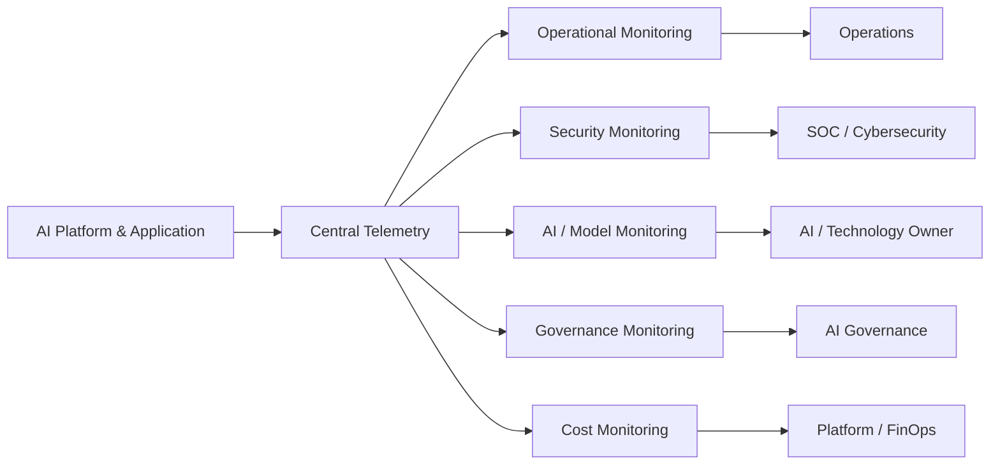
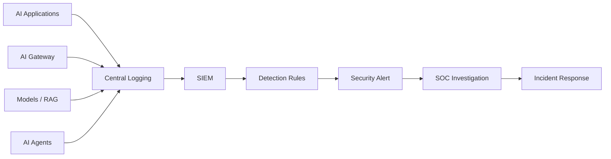
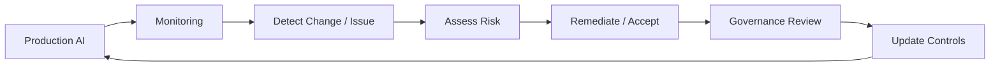

# Enterprise AI Monitoring Framework

## 1. Purpose

This framework defines monitoring and continuous-assurance requirements for Artificial Intelligence systems operated by Austera Transport Group (ATG).

AI governance does not end at production deployment. AI systems may change in behaviour, performance, usage, data exposure and risk throughout their lifecycle.

The framework establishes monitoring across:

- Platform and application health
- Cybersecurity
- Model behaviour and performance
- Generative AI
- Retrieval-Augmented Generation (RAG)
- AI agents
- Data and privacy
- Cost and consumption
- Governance and compliance

---

## 2. Monitoring Objectives

ATG AI monitoring must support:

1. Detection of security threats.
2. Detection of abnormal AI behaviour.
3. Monitoring of model performance.
4. Identification of data exposure.
5. Detection of AI-agent misuse.
6. Validation of guardrail effectiveness.
7. Operational availability and performance.
8. Cost and consumption management.
9. Incident investigation.
10. Continuous governance assurance.

---

## 3. Monitoring Model

ATG uses five monitoring domains:

Monitoring must integrate with existing enterprise operational and security processes wherever practical.

---

## 4. Monitoring by Risk Tier

Monitoring requirements increase according to AI risk.

| Monitoring Area | Tier 1 | Tier 2 | Tier 3 | Tier 4 |
|---|---|---|---|---|
| Availability | Basic | Standard | Enhanced | Enhanced |
| Security Events | Basic | Standard | Enhanced | Enhanced |
| Model Performance | Risk-based | Standard | Enhanced | Enhanced |
| Prompt Attacks | If applicable | Yes | Enhanced | Enhanced |
| RAG Monitoring | If applicable | Standard | Enhanced | Enhanced |
| Agent Monitoring | If applicable | Standard | Enhanced | Continuous |
| Data Exposure | Basic | Standard | Enhanced | Enhanced |
| Human Oversight | Risk-based | Risk-based | Required | Required |
| Governance Reporting | Periodic | Periodic | Regular | Enhanced |
| Reassessment | Event-based | Periodic | Regular | Frequent |

---

## 5. Platform Monitoring

AI infrastructure must be monitored using standard enterprise observability practices.

Metrics may include:

- Availability
- CPU
- Memory
- Storage
- Network performance
- API availability
- Request latency
- Error rates
- Request volume
- Queue depth
- Timeouts
- Dependency failures

Thresholds must reflect business and service requirements.

---

## 6. Application Monitoring

AI applications should monitor:

- Request success/failure
- Application exceptions
- API failures
- Authentication failures
- Dependency availability
- Response latency
- User sessions
- Integration failures
- Rate-limit events

Application monitoring must support root-cause analysis.

---

## 7. Model Monitoring

Production AI models should be monitored according to risk.

Potential indicators include:

- Model availability
- Response latency
- Error rate
- Output quality
- Accuracy
- Model drift
- Response consistency
- Model-version changes
- Unexpected model behaviour

Model monitoring requirements depend on the type of AI system.

---

## 8. Generative AI Monitoring

Generative AI applications require additional monitoring.

Potential indicators include:

- Prompt volume
- Response volume
- Token consumption
- Model usage
- Guardrail triggers
- Content-filter events
- Rejected prompts
- Abnormal prompt patterns
- Hallucination reports
- User feedback
- Sensitive-information events

Monitoring must balance investigation requirements with privacy and information protection.

---

## 9. Prompt Attack Monitoring

Security monitoring should identify potential:

- Direct prompt injection
- Indirect prompt injection
- Jailbreaking
- System-prompt extraction
- Repeated guardrail bypass attempts
- Sensitive-information extraction
- Automated model abuse

Repeated or coordinated attempts should trigger security investigation where appropriate.

---

## 10. RAG Monitoring

RAG solutions should monitor:

- Retrieval success
- Retrieval failures
- Documents retrieved
- Knowledge-source availability
- Permission failures
- Abnormal retrieval volume
- Sensitive-document access
- Vector-store activity
- Document-ingestion failures
- Knowledge-source changes

Monitoring should help detect unauthorised information retrieval and knowledge-base manipulation.

---

## 11. Knowledge Integrity Monitoring

Where risk warrants, ATG should monitor changes to trusted AI knowledge sources.

Potential indicators include:

- Unauthorised document modification
- Unexpected document ingestion
- Unusual bulk changes
- Malicious embedded instructions
- Changes to document permissions
- Knowledge-source poisoning indicators

Critical knowledge sources require stronger integrity controls.

---

## 12. AI Agent Monitoring

AI agents require enhanced observability because they can perform actions.

Monitoring should capture:

- Agent identity
- User initiating the request
- Tools invoked
- APIs called
- Data accessed
- Actions performed
- Approval requests
- Approval decisions
- Failed actions
- Permission failures
- Transaction values
- Administrative activity

Agent actions must be attributable.

---

## 13. Agent Behaviour Analytics

Higher-risk agents should be monitored for abnormal behaviour.

Examples include:

- Unexpected tool usage
- Unusual action frequency
- Repeated permission failures
- Large data retrieval
- Unexpected external communication
- Attempts to access restricted systems
- Transactions outside normal patterns
- Actions outside approved business purpose

Material anomalies must trigger investigation.

---

## 14. Human Oversight Monitoring

Where human approval is a required control, monitoring should confirm that it remains effective.

Indicators may include:

- Number of approvals
- Rejections
- Override frequency
- Approval turnaround
- Repeated approval of abnormal actions
- Bypassed approval workflows

Human oversight should not become an ineffective rubber-stamp control.

---

## 15. Identity Monitoring

AI platforms must integrate with identity monitoring where appropriate.

Monitor:

- Authentication failures
- Privileged logins
- Unusual locations
- Impossible travel where supported
- Role changes
- Privilege escalation
- Service-identity anomalies
- Agent identity usage

---

## 16. Data Protection Monitoring

Monitoring should detect potential:

- Sensitive-information exposure
- Unusual data retrieval
- Bulk downloads
- Unauthorised knowledge access
- Cross-tenant access
- Data exfiltration
- Inappropriate prompt content

DLP capabilities should be integrated where appropriate.

---

## 17. API Monitoring

AI APIs should monitor:

- Request volume
- Authentication failures
- Authorisation failures
- Rate-limit events
- Invalid requests
- Unusual calling patterns
- Excessive errors
- Abnormal data volumes

Internet-facing AI APIs require enhanced monitoring.

---

## 18. Security Monitoring and SIEM

Security-relevant AI telemetry should integrate with enterprise SIEM capabilities where appropriate.

Example:

This allows AI threats to become part of existing cybersecurity operations rather than creating an isolated monitoring capability.

---

## 19. Security Detection Use Cases

Potential detection scenarios include:

| Detection | Example |
|---|---|
| Prompt Attack | Repeated attempts to bypass system instructions |
| Sensitive Data Extraction | User repeatedly requesting restricted information |
| Abnormal Retrieval | Unusual volume of RAG document access |
| Agent Privilege Misuse | Agent attempts unauthorised API operation |
| Credential Exposure | Secret detected within AI input/output |
| Model Abuse | Automated high-volume malicious requests |
| Knowledge Poisoning | Unexpected modification to trusted source |
| Privilege Escalation | AI identity receives unexpected permission |
| API Abuse | Abnormal request volume or calling pattern |

Detection rules must be tuned to minimise both missed events and excessive false positives.

---

## 20. Privacy Monitoring

Where AI processes personal information, monitoring should consider:

- Unexpected personal-data access
- Excessive data retrieval
- Retention violations
- Unauthorised processing
- Data export
- Privacy incidents

Monitoring itself must not unnecessarily replicate personal information.

---

## 21. Cost and Consumption Monitoring

AI services may introduce significant variable consumption costs.

Monitor:

- Token usage
- API consumption
- Model usage
- Compute
- Storage
- Vector database consumption
- Agent transactions
- Cost by application
- Cost by business unit

Budgets and alerts should be implemented where appropriate.

---

## 22. Unbounded Consumption

AI applications must monitor for resource-consumption patterns that could indicate:

- Abuse
- Runaway agents
- Infinite loops
- Excessive model requests
- Unexpected automation
- Denial-of-wallet attacks

Rate limits, quotas and budgets should be implemented where appropriate.

---

## 23. Governance Monitoring

The AI governance function should monitor:

- Number of registered AI systems
- Risk-tier distribution
- Outstanding risk treatments
- Expired exceptions
- Overdue assessments
- AI incidents
- Vendor-assessment status
- Model changes
- Control failures
- Reassessment status

This provides enterprise-level visibility of AI risk.

---

## 24. Key Risk Indicators

Example AI Key Risk Indicators (KRIs):

| KRI | Example Threshold |
|---|---|
| Critical AI incidents | Any occurrence |
| Sensitive-data disclosure | Any confirmed occurrence |
| Unapproved AI systems | > 0 |
| Expired high-risk exceptions | > 0 |
| Overdue Tier 4 reassessments | > 0 |
| Critical control failures | > 0 |
| Unauthorised agent actions | Any occurrence |

Actual thresholds must reflect organisational risk appetite.

---

## 25. Key Performance Indicators

Potential KPIs include:

- AI service availability
- Mean response latency
- Model error rate
- Successful retrieval rate
- Guardrail effectiveness
- Incident resolution time
- Assessment completion
- Risk-treatment completion
- User satisfaction
- Cost per AI transaction

KPIs must not replace risk indicators.

---

## 26. Alert Severity

AI alerts should align with existing enterprise incident severity models.

Example:

| Severity | Example |
|---|---|
| Informational | Normal guardrail event |
| Low | Repeated invalid prompts |
| Medium | Suspicious retrieval behaviour |
| High | Suspected sensitive-data exposure |
| Critical | Confirmed compromise or unsafe autonomous action |

Severity must consider business impact, data sensitivity and AI autonomy.

---

## 27. Escalation

Monitoring alerts must have defined ownership.

Potential escalation paths include:

**Operational Alert → Technology Owner**

**Security Alert → SOC / Cybersecurity**

**Privacy Alert → Privacy**

**AI Behaviour Issue → AI / Technology Owner**

**Material AI Risk → AI Governance Committee**

Critical incidents may require executive escalation.

---

## 28. Monitoring Responsibilities

### Technology Owner
Responsible for platform and application monitoring.

### Cybersecurity
Responsible for security detection and investigation.

### AI Delivery Team
Responsible for application/model telemetry.

### Data Governance
Supports data-quality and data-governance monitoring.

### Privacy
Oversees privacy-related monitoring requirements.

### Business Owner
Monitors business outcomes and material AI behaviour.

### AI Governance Committee
Receives enterprise AI risk and assurance reporting.

---

## 29. Monitoring Evidence

Monitoring evidence may include:

- Dashboards
- SIEM alerts
- Audit logs
- Model metrics
- Agent activity logs
- Incident records
- Risk reports
- Cost dashboards
- Governance reports

Evidence should be retained according to organisational requirements.

---

## 30. Continuous Assurance

Monitoring outcomes must feed back into governance.

AI governance therefore operates as a continuous lifecycle rather than a one-time approval process.

---

## 31. Reassessment Triggers

Monitoring may trigger formal reassessment following:

- Security incident
- Privacy incident
- Significant model drift
- Material increase in autonomy
- Unexpected AI behaviour
- Major model change
- New data source
- New enterprise integration
- Material increase in external exposure
- Repeated control failure

---

## 32. Monitoring Review

Monitoring requirements should be periodically reviewed to determine whether:

- Telemetry remains sufficient
- Detection rules remain effective
- New AI threats have emerged
- Business use has changed
- AI autonomy has increased
- Risk classification remains appropriate

---

## 33. Framework Alignment

This monitoring framework supports ATG's broader alignment with:

- NIST AI Risk Management Framework
- ISO/IEC 42001
- NIST Cybersecurity Framework
- AI security good practices
- Enterprise security and risk-management requirements

---

## 34. Related Artefacts

- Enterprise AI Governance Framework
- AI Risk Classification Methodology
- AI Security Standard
- AI Control Catalogue
- Security Control Mapping
- Enterprise AI Reference Architecture
- AI Vendor Security & Governance Assessment
- AI Go-Live Assurance Checklist
- AI Incident Management Framework

---

## Disclaimer

Austera Transport Group (ATG) is a fictional organisation created solely for this professional portfolio project.

This framework is a reference model and must be adapted to specific organisational, technical, regulatory and operational requirements.
