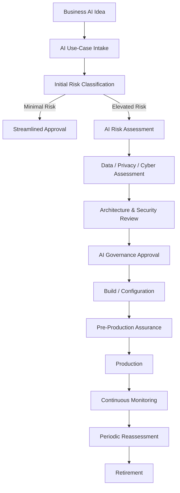
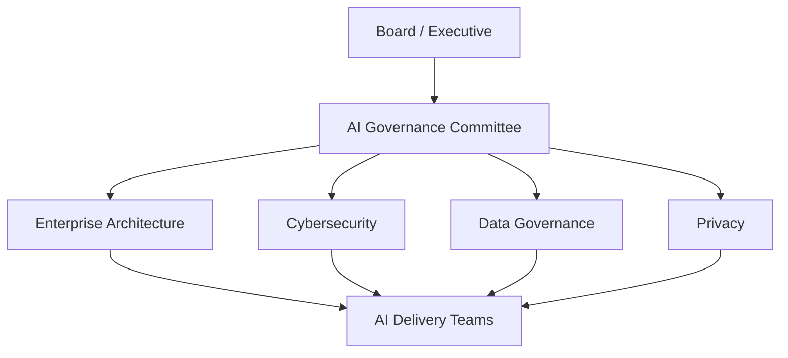

Enterprise AI Governance Framework

A practical enterprise framework for governing, securing and managing Artificial Intelligence across its lifecycle.

This repository provides a reference Enterprise AI Governance Framework designed to help organisations adopt Artificial Intelligence securely, responsibly and at enterprise scale.

The framework demonstrates how AI governance can be translated from high-level principles into practical governance processes, risk assessments, security controls, architecture guardrails, assurance activities and continuous monitoring.

The reference scenario uses a fictional Australian critical-infrastructure organisation, Austera Transport Group (ATG), operating across Microsoft Azure and AWS.

⸻

1. Executive Overview

Artificial Intelligence is increasingly being introduced into organisations through:

* Generative AI platforms
* Enterprise copilots
* Large Language Models (LLMs)
* Retrieval-Augmented Generation (RAG)
* AI-enabled SaaS platforms
* Machine-learning solutions
* Predictive analytics
* Agentic AI and autonomous workflows

While these technologies provide significant opportunities, they also introduce new risks relating to:

* Sensitive data exposure
* Privacy
* Cybersecurity
* AI model security
* Prompt injection
* Hallucination and unreliable outputs
* Bias and fairness
* Third-party AI services
* Regulatory compliance
* Intellectual property
* Lack of accountability
* Excessive AI autonomy

Organisations therefore require governance that enables AI adoption while ensuring that risk remains within acceptable organisational tolerances.

This project provides a practical model for establishing that capability.

⸻

2. Reference Organisation

Austera Transport Group — ATG

ATG is a fictional Australian transport and critical-infrastructure organisation.

The organisation operates a hybrid technology environment consisting of:

* Microsoft Azure
* Amazon Web Services (AWS)
* SaaS platforms
* On-premises systems
* Operational technology integrations
* Enterprise data platforms
* API and integration platforms

ATG is progressively introducing AI across corporate and operational environments.

Example initiatives include:

* Microsoft Copilot
* Internal enterprise AI assistants
* Enterprise RAG solutions
* Predictive maintenance
* Customer-service AI
* AI-assisted software development
* Document intelligence
* Security analytics
* Third-party AI SaaS
* Agentic AI workflows

The organisation requires an enterprise governance framework before these capabilities can be adopted at scale.

⸻

3. Business Problem

AI adoption can occur faster than traditional governance processes can accommodate.

Without appropriate controls, organisations may experience:

* Unapproved AI services
* Sensitive information being submitted to public AI platforms
* Inconsistent security assessments
* Unknown AI assets and models
* Insufficient human oversight
* Unclear accountability
* Unmanaged third-party AI risks
* Inadequate model monitoring
* AI-generated decisions without appropriate assurance
* Security vulnerabilities within AI applications
* Inability to demonstrate regulatory compliance

The challenge is therefore not simply:

How do we prevent risky AI?

The more useful question is:

How do we enable responsible AI adoption while maintaining appropriate security, risk and governance controls?

⸻

4. Framework Objectives

The Enterprise AI Governance Framework aims to:

1. Establish clear accountability for AI.
2. Maintain visibility of enterprise AI systems.
3. Introduce risk-based AI governance.
4. Protect organisational and customer information.
5. Establish security requirements for AI systems.
6. Implement appropriate human oversight.
7. Establish architecture and engineering guardrails.
8. Assess third-party AI providers.
9. Monitor AI systems throughout their lifecycle.
10. Establish processes for AI incidents and failures.
11. Enable responsible AI innovation without unnecessary governance overhead.

⸻

5. Governance Principles

The framework is based on the following principles.

Accountability

Every AI system must have an identified business owner accountable for its purpose, operation and risk.

Risk-Based Governance

Governance requirements should be proportional to the potential impact of the AI system.

Security by Design

Security controls must be incorporated into AI architectures from initial design rather than introduced after deployment.

Privacy by Design

Personal and sensitive information must be appropriately protected throughout the AI lifecycle.

Human Oversight

AI systems affecting significant decisions should include appropriate human review and intervention.

Transparency

The organisation should understand where AI is being used and how significant AI-supported decisions are produced.

Data Governance

AI systems must use authorised, appropriately classified and quality-controlled information.

Continuous Assurance

AI risk does not end when a system enters production. Systems must be continuously monitored and periodically reassessed.

⸻

6. AI Governance Lifecycle

Every enterprise AI use case follows a defined lifecycle.



This lifecycle ensures governance is integrated into technology delivery rather than operating as a separate compliance exercise.

⸻

7. AI Risk Classification

AI systems are classified according to their potential organisational impact.

Tier	Classification	Example
Tier 1	Minimal	Public-information summarisation
Tier 2	Limited	Internal knowledge assistant
Tier 3	High	AI influencing customer or operational decisions
Tier 4	Critical	Autonomous/high-impact AI affecting safety or critical infrastructure

Governance requirements increase with risk.

Tier 1 — Minimal

Typical requirements:

* AI use-case registration
* Acceptable-use compliance
* Basic security requirements

Tier 2 — Limited

Additional requirements:

* Data assessment
* Privacy assessment
* Security review
* Business ownership
* AI monitoring

Tier 3 — High

Additional requirements:

* Formal AI risk assessment
* Threat modelling
* Architecture review
* Model evaluation
* Human oversight
* AI Governance Committee approval

Tier 4 — Critical

Additional requirements:

* Executive risk acceptance
* Independent assurance
* Enhanced security controls
* Continuous monitoring
* Resilience and fail-safe mechanisms
* Formal incident-response planning
* Regular reassessment

⸻

8. Governance Operating Model

AI governance requires participation across multiple organisational functions.



Typical stakeholders include:

* Executive leadership
* CIO / CTO
* CISO
* Enterprise Architecture
* Cybersecurity
* Data Governance
* Privacy
* Legal
* Risk
* AI/ML engineering
* Cloud/platform engineering
* Business owners
* Internal audit

⸻

9. AI Governance Decision Model

AI use cases may receive one of four outcomes:

Approved

The use case satisfies governance requirements.

Approved with Conditions

The use case may proceed once identified controls are implemented.

Remediation Required

Significant issues must be addressed before approval.

Rejected

The risk cannot be sufficiently mitigated or is outside organisational risk appetite.

⸻

10. Architecture Governance

AI governance must translate policy into technical architecture.

Architecture reviews therefore consider:

* Identity and access management
* Network isolation
* Model access
* API security
* Secrets management
* Data classification
* Encryption
* RAG architecture
* Vector databases
* Prompt security
* AI gateways
* Content filtering
* Logging
* Monitoring
* Model observability
* Data-loss prevention
* Third-party integrations
* Human approval controls
* AI agent permissions

Architecture patterns and technical guardrails will be developed within this repository.

⸻

11. AI Security

AI systems introduce attack paths that may not exist within traditional applications.

Examples include:

* Prompt injection
* Indirect prompt injection
* Sensitive information disclosure
* Model manipulation
* Insecure model integrations
* Excessive agent permissions
* Supply-chain compromise
* Poisoned knowledge sources
* Insecure output handling
* AI-assisted privilege escalation

AI threat modelling and security-control patterns are therefore incorporated into the governance process.

⸻

12. Third-Party AI Governance

AI SaaS and external model providers require additional assessment.

Supplier reviews consider:

* Data ownership
* Data residency
* Model training practices
* Retention
* Privacy
* Encryption
* Identity integration
* Security certifications
* Incident notification
* Sub-processors
* Model transparency
* Service availability
* Exit strategy

⸻

13. AI Inventory

ATG maintains a central inventory of AI systems.

Example:

AI System	Owner	Type	Data Classification	Risk Tier	Status
Corporate Copilot	Digital Workplace	GenAI	Internal	Tier 2	Approved
Enterprise Knowledge Assistant	Technology	RAG	Confidential	Tier 3	Assessment
Predictive Maintenance AI	Operations	ML	Operational	Tier 3	Pilot
Autonomous Operations Agent	Operations	Agentic AI	Critical	Tier 4	Proposed

The inventory enables visibility, accountability and lifecycle management.

⸻

14. Framework Alignment

The framework is designed with reference to established AI, cybersecurity and risk-management practices, including:

AI Governance

* NIST AI Risk Management Framework (AI RMF)
* ISO/IEC 42001 Artificial Intelligence Management System
* Australian Government guidance for responsible AI adoption

Cybersecurity

* NIST Cybersecurity Framework
* ISO/IEC 27001
* Australian Information Security Manual
* Essential Eight

AI Security

* OWASP guidance for LLM and Generative AI security
* MITRE ATLAS

Detailed control mappings will be developed as separate artefacts within the repository.

⸻

15. Repository Structure

## Repository Structure

```text
enterprise-ai-governance-framework/
│
├── 01-governance/
│   ├── ai-governance-framework.md
│   ├── ai-principles.md
│   ├── governance-operating-model.md
│   └── roles-and-raci.md
│
├── 02-risk/
│   ├── ai-risk-classification.md
│   ├── ai-risk-assessment.md
│   ├── ai-risk-register.xlsx
│   └── ai-use-case-assessment.md
│
├── 03-policies/
│   ├── responsible-ai-policy.md
│   ├── generative-ai-policy.md
│   ├── ai-security-standard.md
│   └── acceptable-ai-use-policy.md
│
├── 04-controls/
│   ├── ai-control-catalogue.xlsx
│   ├── nist-ai-rmf-mapping.xlsx
│   ├── iso-42001-mapping.xlsx
│   └── security-control-mapping.xlsx
│
├── 05-architecture/
│   ├── ai-reference-architecture.md
│   ├── architecture-principles.md
│   └── diagrams/
│
└── 06-assurance/
    ├── ai-vendor-assessment.md
    ├── ai-go-live-checklist.md
    ├── ai-monitoring-framework.md
    └── ai-incident-management.md
```

⸻

16. Target Outcomes

An organisation implementing this framework should be able to answer:

* What AI systems are operating within the organisation?
* Who owns them?
* What information can they access?
* What risks do they introduce?
* What security controls protect them?
* Which AI systems require human oversight?
* Which models and providers are approved?
* How are AI systems monitored?
* How are AI incidents managed?
* How can compliance be demonstrated?

⸻

17. Portfolio Roadmap

This project forms part of a broader Cloud, Cybersecurity and AI Architecture portfolio.

Planned companion projects include:

1. Enterprise AI Governance Framework
2. Secure Enterprise GenAI/RAG Reference Architecture
3. Multi-Cloud Security Governance Framework
4. AI Security Threat Modelling Framework
5. Cloud & AI Security Compliance Accelerator

Together these projects demonstrate the progression from:

Governance → Risk → Architecture → Security → Controls → Automation → Assurance

⸻

Disclaimer

This repository is an independent reference architecture and professional portfolio project.

Austera Transport Group (ATG) is entirely fictional.

The project does not represent the architecture, security controls, policies or confidential information of any current or former employer or client.

Framework references are provided for educational and architectural purposes. Organisations should independently assess applicable legal, regulatory, security and compliance obligations before implementing AI systems.
